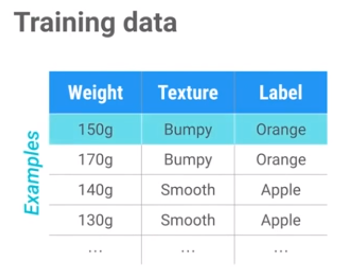
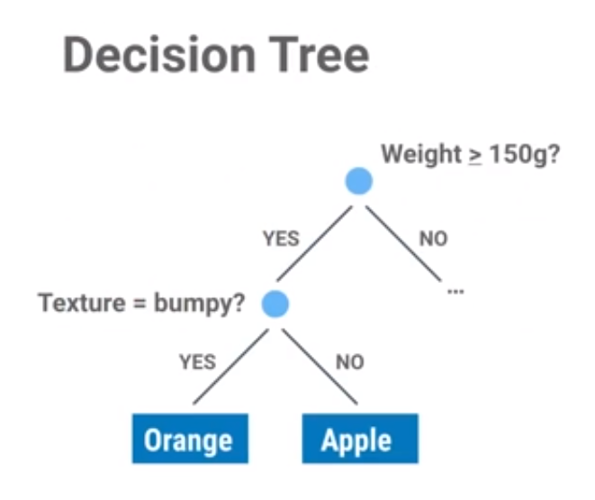

# 6行代码带你机器学习编程入门

两个开源库：scikit-learn 和 TensorFlow

什么是机器学习？  可以把机器学习看作是人工智能的一个子领域，初期的人工智能程序只能做好一件事，例如深蓝只能下国际象棋，甚至获得冠军，但是它只会下棋。现在，我们写的程序可以解决很多问题，而不需要重新编码，AlphaGO就是其中一个例子，他不但获得了国际围棋的冠军，同时它也可以玩雅特丽游戏，机器学习将这一期变成现实。

我们要学习的就是这样一种可以从样本数据中学习的算法，而取代了硬编码规则，这真的是太先进了，但是我们会用简单的例子开始我们的编程。

有一个很简单，但是没有机器学习的算法你却很难解决的问题。你能写一个区别苹果和橘子的代码吗？

比如：你可以写一个程序将橘子的像素点相加，然后比较其中绿色像素点的数量，然后这个比例可以给你判断这是哪种水果的依据，但是只有一些简单图片才能保证这种算法不会出错。

但是当你更深刻看待这个问题的时候，你将会发现真实的世界充满着不确定因素，你好不容易写的规则可能被一些个例打破，你要写怎样的代码才能识别黑白照片，或者途中根本没有苹果和橘子呢？

事实上，不管你写多少规则，都能找到一张让他无法识别的图片，你必须写上千条规则，而仅仅只是用来识别橘子和苹果。如果换个问题，你又得重新写这些代码。

很明显，我们需要一种更有效的方法，为了解决这类问题，我们需要一种算法，可以自动生成规则，这样我们就不需要一条条重复劳动了，为了做到这些，我们需要训练一个分类器(Classifier)

实现分类器的技术称为 监督学习，对于监督学习而言，有这样几个基本的步骤我们得去实现：

第一步：收集训练数据，这里有几个我们想解决的问题，为了解决他们，我要写一个功能来区分水果，首先，我们将描述的水果属性作为输入数据，然后根据类似重量，质感等特征，对收集到的数据进行预测：这个水果是苹果还是橘子，

为了收集我们需要的数据，想象我们来到一片果园，观察苹果跟橘子的不同之处，然后我们把测量好的数据记录在一张表中，在机器学习中，我们把这种测量得到的值叫做特征，为了简化问题，我们这里只用到两个值，水果重多少克和质感是粗糙还是平滑。

好的数据特征，能更好地区分水果的种类

表格中的每一行都是我们训练数据的一个样本，它描述了一个水果的属性，最后一列我们把它叫做标签，是用来标注每行数据是什么水果，当然这里我们只有两种可能性：苹果或橘子。整个表格都是我们的训练数据。我们的数据越多，分类器就能更好地工作 。

我们用到的分类器类型，叫做 决策树

我们把分类器看成是汇集了很多规则的盒子，因为其实有很多类型的分类器，但是输入输出类型总是一样的

为了训练分类器，我们需要一种学习算法，如果分类器是集成了一系列规则的盒子，你可以把学习算法想成是，创造这个盒子的过程，它通过训练数据来寻找一些固有的模式

在scikit-learn 这个库里，训练算法包含在分类器实物里，叫做Fit，你可以把Fit 理解为发现数据固有模式的同义词

分类器的输入是一些新的实例的特征测量值

用这些整齐的数据来编写机器学习并不难，但在掌握它之前，你还需要理解一些重要的概念：

分类器，有很多种，比如神经网络(Artificial neural network)、支持向量机(Support Vector Machine)

我们为什么首先使用决策树呢？

因为决策树有一大特点：简单易读，便于理解，实际上，决策树是为数不多的可解释的分类器

莺尾花

1、Import dataset

2、Train a classifier

3、Predict label for new flower

4、Visualize the tree

学习如何使用已有的数据集是很有用的

决策树提出的每一个问题，必须针对某个特征，那就意味着你选的特征越可靠，决策数的准确性就越高

分类器的优秀之处，只在于你所提供的各样不同的特性，这意味着具备好的特性，是你在机器学习里，最重要的工作，但是什么是好的特性，并且你怎么能知道

到底应该使用多少特性，是一门艺术而不是一门科学，但是作为一个经验法则，想想你需要多少特征来解决问题

各种特征是独立的，独立特征给你不同类型的信息

看待分类器的一种方式是看成一种函数，在更高的层面，你可以认为x是输入，y是输出

尽管有各种类型的分类器，在更高层次上，他们拥有相似的接口

看待学习的一种方式，就是用训练数据调整模型的参数

TensorFlow游戏场，这是神经网络的一个优美范例

你可以把神经网络当作一个复杂的分类器，像决策树或简单直线，但理论上，思想是相似的

http://playground.tensorflow.org/