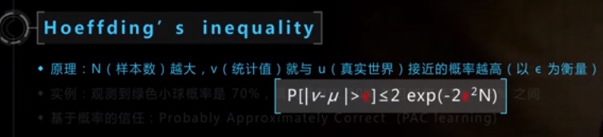
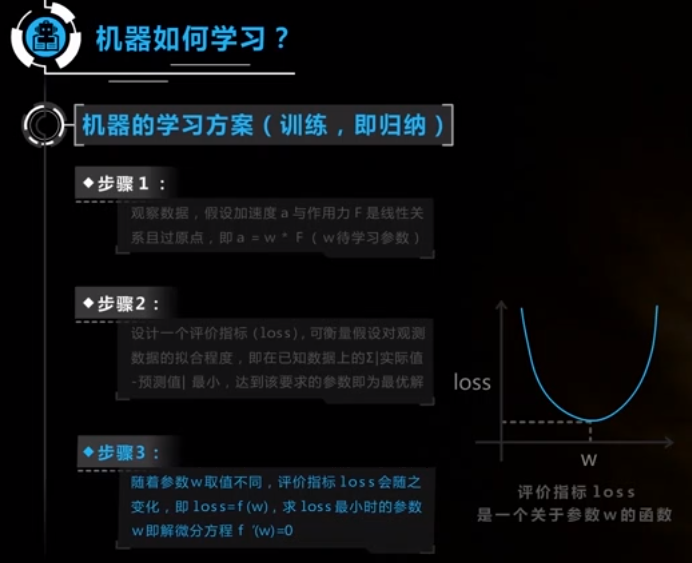

### 人工智能在游戏开发中的应用

问题：

​	1、名词解释：人工智能、卷积神经网络、深度学习、机器学习

​	2、人工智能能给我们的游戏开发带来哪些具体的应用和提升

​	3、人工智能具体应该怎么应用和开发，以及人工智能的数据集要怎么训练

人工智能产业化

 开创者 经验者 应用者

知识未必会用上，但思想长存

科学原理是朴素的

人类学习的方式： 归纳 演绎， 归纳演绎不一定是靠谱的

统计学习是正确的方式，而不是个案学习

不但要用归纳的方式去总结一些规律，但是一定要基于统计大量的案例 （尽人事，听天命）

人类，观察样本决定了人生观，对于小孩来说，让他们观察到一些正确的样本是形成正确世界观非常重要的东西。

学习好的真正价值是能够观察到一些更正向的样本，从而形成积极的世界观

统计学靠谱吗？

从已有的规律得到的一个结论，完全没办法得知真实的情况

从看到的样本中总结规律，完全无法预测未知的世界

大数定律：当试验次数足够多的时，事件出现的频率无穷接近于该事件发生的频率

现实故事：“曾参杀人”：三人成虎，一则无心，二则疑，三则信矣

建模经验：人工规则->学习模型，数据少要重视先验，数据多重视后验，如抛硬币

大数定律数学表达 Hoeffding`s inequality

观点1：基于概率的信任：Probably Approximately Correct (PAC learning)

观点2：观测样本越多，结论就越发置信

奥卡姆剃刀原则：多个假设可能的情况下，相信最简单的那个

正确的关系至少应该很好拟合（已知的）观测数据

牛顿第二定律：

观察数据，假设加速度a与作用力F是线性关系且过原点，即 a = w * F ( w 待学习参数)

设计一个评价指标（loss），可衡量假设对观测数据的拟合程度，即已知数据上，实际值 - 预测值的和 最小，达到该要求的参数即为最优解

随着参数w的不同，评价指标loss也会随之变化，即loss = f(w)，求loss最小时的参数w，即解微分方程 f`(w) = 0

取平方加和是一种优化方式

三个核心要素：

​	假设空间：线性假设

​	优化目标（评价指标）：（实际值-预测值）的平方和 

​	寻解算法：求解微分方程（公式解）

这就是整个机器学习的算法框架

三个核心要素：多种多样的可能

三者各种设计的组合，形成众多的模型