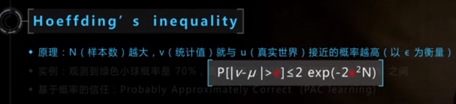
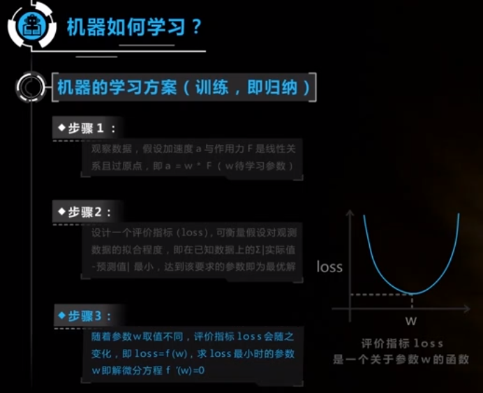
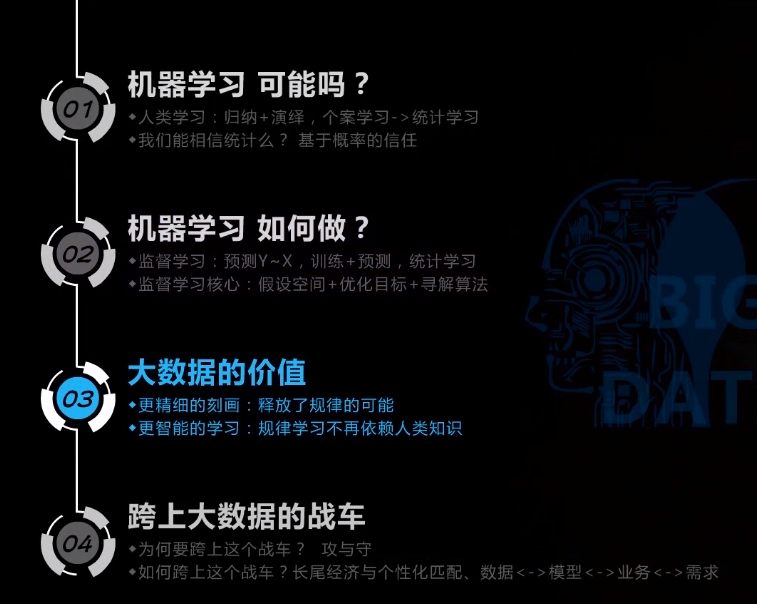

# 机器学习的思考故事

人工智能产业化

 开创者 经验者 应用者

知识未必会用上，但思想长存

科学原理是朴素的

人类学习的方式： 归纳 演绎， 归纳演绎不一定是靠谱的

统计学习是正确的方式，而不是个案学习

不但要用归纳的方式去总结一些规律，但是一定要基于统计大量的案例 （尽人事，听天命）

人类，观察样本决定了人生观，对于小孩来说，让他们观察到一些正确的样本是形成正确世界观非常重要的东西。

学习好的真正价值是能够观察到一些更正向的样本，从而形成积极的世界观

统计学靠谱吗？

从已有的规律得到的一个结论，完全没办法得知真实的情况

从看到的样本中总结规律，完全无法预测未知的世界

大数定律：当试验次数足够多的时，事件出现的频率无穷接近于该事件发生的频率

现实故事：“曾参杀人”：三人成虎，一则无心，二则疑，三则信矣

建模经验：人工规则->学习模型，数据少要重视先验，数据多重视后验，如抛硬币

大数定律数学表达 Hoeffding`s inequality

观点1：基于概率的信任：Probably Approximately Correct (PAC learning)

观点2：观测样本越多，结论就越发置信

奥卡姆剃刀原则：多个假设可能的情况下，相信最简单的那个

正确的关系至少应该很好拟合（已知的）观测数据

牛顿第二定律：

观察数据，假设加速度a与作用力F是线性关系且过原点，即 a = w * F ( w 待学习参数)

设计一个评价指标（loss），可衡量假设对观测数据的拟合程度，即已知数据上，实际值 - 预测值的和 最小，达到该要求的参数即为最优解

随着参数w的不同，评价指标loss也会随之变化，即loss = f(w)，求loss最小时的参数w，即解微分方程 f`(w) = 0

取平方加和是一种优化方式

三个核心要素：

​	假设空间：线性假设

​	优化目标（评价指标）：（实际值-预测值）的平方和 

​	寻解算法：求解微分方程（公式解）

这就是整个机器学习的算法框架

三个核心要素：多种多样的可能

三者各种设计的组合，形成众多的模型

大数据的价值

更精细的刻画：释放了规律的可能

更智能的学习：规律学习不再依赖人类知识

用大数定律理解从数据中认知的“两难”：

​	一方面 数据要足够细分类（够准确）

​	一方面 保证分类中数据量（够准确）

大数据可以同时实现两方面，释放了规律的可能

​	大样本使大特征成为可能

​	大特征使大样本发挥价值

​	机器学习中的马甲：过拟合 与 欠拟合

越来越只能的过程，也是所需数据量越来越大的过程

​	阶段1：规律=全部 领域知识（数学公式），数据用于启发思路和验证假设	力学第二定律

​	阶段2：规律=大部分 领域知识 + 小部分 统计学习	自然语言处理的语法解析 He drive down the street in the car

​	阶段3：规律=小部分 领域知识 + 大部分 统计学习	图像识别模型 识别人脸

​	阶段4：规律=全部 统计学习	人类的大脑

数据量和数据内涵都是非线性增长

跨上大数据的战车

​	攻：促进业务发展；守：核心竞争力；

核心竞争力：

​	商业上的成功：技术->满足需求->控制供给

​	市场角度理解创新：创新是追求垄断，垄断是追求利润

​	技术创新知识一个领先的时间窗口，需要进入产品领先与数据领先的正向循环

​	技术和产品的壁垒期缩短，数据领先是相对安全、轻松的垄断模式

**没有任何技术是永远的黑科技**

想把机器学习和大数据技术应用到具体的业务中，这个往往不是技术的事情，而是需要从：数据<->模型<->业务<->需求等多方面，形成一个完整的链条，才能形成的

大数据应用场景

​	个性化匹配：在长尾经济与共享经济下的全新业务模式

​		农业时代：个性化生产 个性化产品

​		工业时代：规模化生产 规模化产品

​		信息时代：规模化生产 个性化产品

​	代替人工：业务中的人工环节，引入智能模型，提升效率

​		基于大数据的智能学习，代替机械性的人工服务：机器翻译，人脸检测的安保系统，电商的自动客服，		无人车

大数据不仅仅是数据技术，需要完整产业链条

数据<->模型<->业务<->需求

案例：购鞋数据 <->个性化推荐模型<->鞋厂鞋店业务<->个性化配鞋需求

缺少业务和需求，数据没有价值

为什么互联网是大数据的乐园？

个性化数据收集，个性化策略执行

AlphaGO前提：死规则、单一场景、取巧的海量数据

机器擅长：单一场景，同类型海量数据做判断

人类擅长：关联场景，不同类型的少量场景联想抽象

机器能代替人工的：“3秒钟准则”，我的工作是否3秒钟之内做出判断，可以的：例如开车，将会被取代

个性化学习路径

案例背景

​	知识点呈现网状关系，课本都是单一路径

​	针对每个学生，推荐个性化学习路径

方案

​	形成学习路径的候选集

​	设定优化目标

​	利用历史数据建模

产品需要有其他的启动优势，个性化学习路径只能作为发展后劲

需要对用户需求做更细致的调研，确定该需求不是“假想”

数据技术不是壁垒，数据本身才是壁垒

什么样的企业才是AI企业？并不是这个企业有自身的AI工程师，需要整个企业的决策层，整个企业的产品经理，业务人员，全需要对AI有一个深入的理解，才能是我们的业务产生一个质的变化

找不到龙的屠龙者：主动发现我们业务中有哪些点可以被我们解决

黑盒工具的鼓吹者：往往我们解决问题的模型是非标准模型

