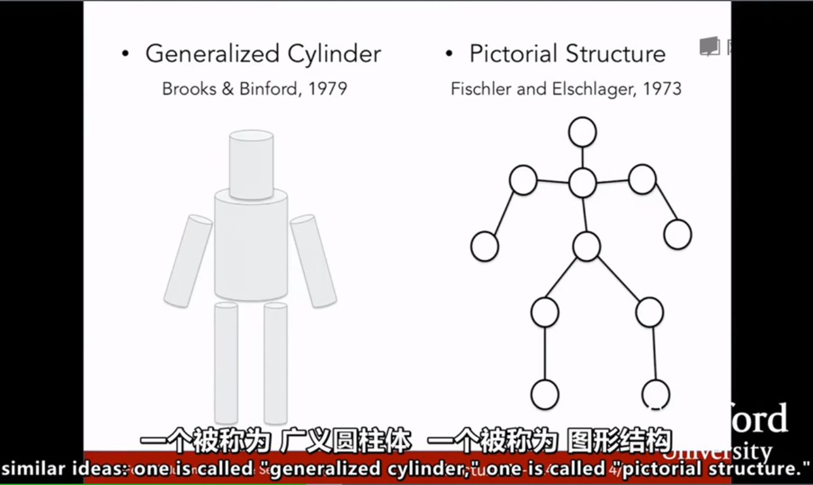
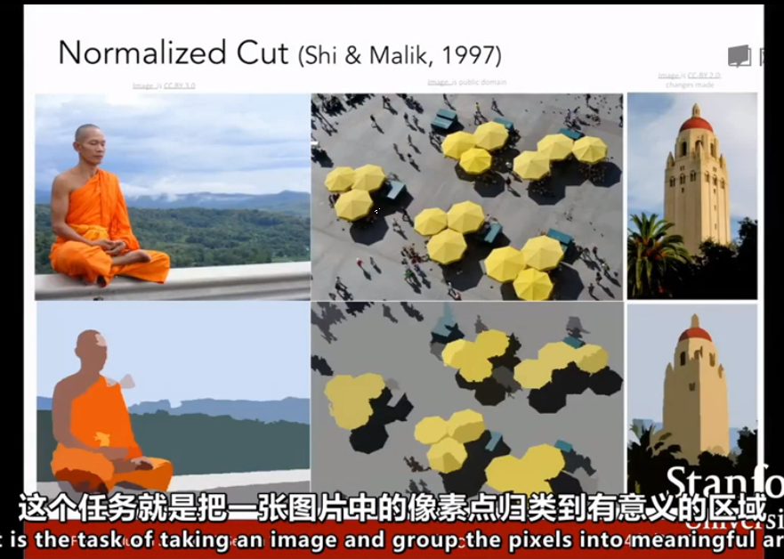
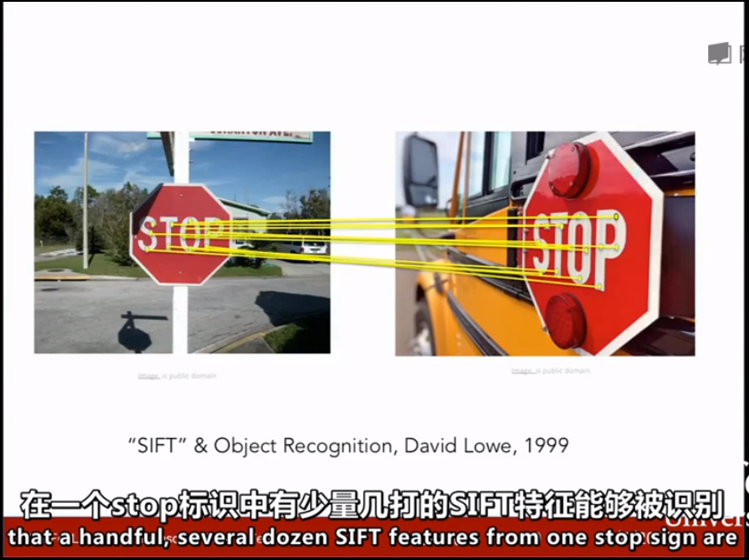
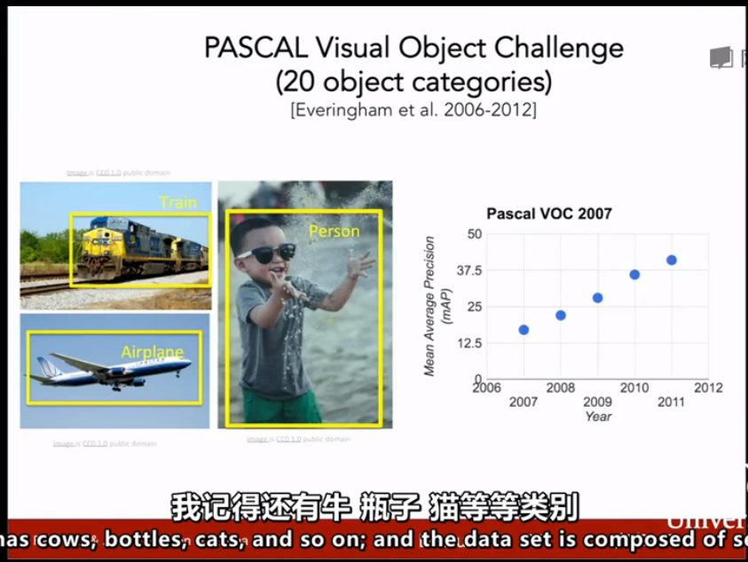
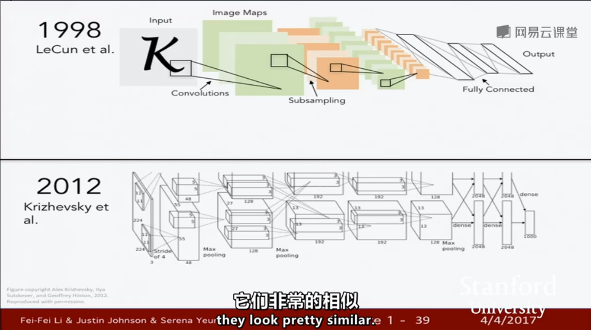

#### 计算机视觉历史背景

​	60年代： David Marr 表示 ：为了拍摄一幅图像，并获得视觉世界的最终全面地3D表现，我们必须经历几个阶段：

​	第一个阶段：“原始草图”，大部分边缘、端点、虚拟线条、曲线、边界等都被用其它元素来表示，这是受到神经科学家的启发，视觉处理的早期阶段有很多关于向边缘的简单结构。

​	第二个阶段：边缘和曲线之后的下一步是 “2.5维草图”，我们开始将表面深度信息层 或 视觉场景的不连续型拼凑在一起

​	第三个阶段：最终将所有的内容放在一起，并在表面和体积图等分层组织了一个3d模型。

​	这是一个非常理想化的思想过程，非常直观的阐述如何解析视觉信息。

​	70年代：如何越过简单的块状世界，开始识别和表示现实世界。两种思想：广义圆柱体 和 图形结构：

​	基本思想都是每个对象都由简单的几何图单位组成，例如：一个人通过广义的圆柱形形状拼接在一起，或者 人也可以由一些关键元素按照不同的间距组合在一起。他们都是将物体的复杂结构简化成一个由更简单的形状和几何结构的集合体。

​	80年代：重建或者识别由简单的物体结构组成的是视觉空间。 

​	曾经的这些努力都试图去思考，从60年代到80年代，计算机视觉的任务是什么，要解决物体识别的问题非常难，这些都是非常有脑洞，有野心的尝试，但是他们仅仅停留在简单样本的阶段，或者很少的样本，没有产生很大的进展，没有输出可以在现实世界有用的东西。

​	在解决视觉问题过程中出现的问题时：

​	一个很重要的问题是：如果目标识别太难了，那么我们首先要做的是目标分割，这个任务就是把一张图片中的像素点归类到有意义的区域。这个过程就叫做图像分割。

​	另一个问题，先于其他计算机视觉问题有进展：面部识别 ，1999-2000年机器学习技术，特别是统计机器学习方法开始加速发展，出现了一些方法：支持向量机模型，boosting方法，图模型，有一种特别工作做出了很多贡献，就是使用AdaBoost算法进行实时面部检测。

​	关于如何才能更好地目标识别，这是一个我们可以继续研究的领域。90年代末到2000年的前十年有一个非常有影响力的思想方法就是基于特征的目标识别，一个影响深远的工作叫SIFT特征，思路就是去匹配整个目标，通过观察目标的某些部分，某些特征，它们往往能够在变化中具有表现性和不变性 。

​	所以目标识别首要任务是在目标上确认这些关键的特征，然后把这些特征与相似的目标进行匹配，它比匹配整个目标要容易很多。

​	使用相同的构成要素特征和图片中的表现特征。我们这个领域的另一进展是识别整幅图的场景，这里有一个算法作为例子，叫做 空间金字塔匹配，背后的思想是：图片里面有各种特征，这些特征可以告诉我们这是哪种场景。这个算法从图片的各部分个像素抽取特征，并把他们放在一起，作为一个特征描述符，然后在特征描述符上做一个支持向量机。

​	在认知人类方面，方向梯度直方图  和  可变形部件模型。

​	从60-70-80年代，图片质量一直在变化 ，随着互联网和数码相机的发展，计算机视觉的研究也能拥有更好的数据了，计算机视觉在21世纪早期，指出一个非常重要的基本问题，这个问题不仅必须要解决，而且是非常重要的识别问题，就是目标识别。

​	目标识别方面取得的成果，其中最有影响力的标注数据集之一叫：PASCAL Visual Object Challenge 这个数据集有20个类别，数据集中的每种类别有成千上万张图片，现场不同的团队开发算法来和数据测试集做对抗训练来看有没有优化 

​	2012年：我们是否具备了识别真实世界中的每一个物体的能力，或者说大部分物体，这个问题也是由机器学习中的一个现象驱动的，就是大部分的机器学习算法，无论是图模型、支持向量机或者AdaBoost 都很可能会在训练过程中 过拟合，部分原因是可视化的数据非常复杂，正因为它们太复杂了，我们的模型往往维数比较高，输入的是高维模型，则还有一堆参数要调优，当我们的训练数据量不够时，很快就会产生过拟合现象，这样我们就无法很好地泛化。

​	因此就是有两方面动力，一是我们单纯就是想识别自然世界中的万物，二是要回归机器学习，克服机器学习的瓶颈，过拟合问题。

​	2012年出现 一种算法：卷积神经网络模型~

​	课程重点：深入研究什么是卷积神经网络，就是现在被熟知的深度学习，该领域有哪些模型，模型原理是什么，又有哪些好的实践，以及该领域最新的进展是什么，首先了解神经网络是什么时候出现的，在2012年，Convolutional Neural Network Model CNN模型 或 深度学习，展示了强大的模型容量和能力，在计算机视觉领域与其他领域，例如自然语言处理和语音识别领域，一起取得了巨大的进步 

​	第一个重点：图像分类问题，其他视觉识别问题：他们建立在我们专门为图像分类 而开发的各种工具上，例如：目标检测、图像摘要生成等

​	卷积神经网络的确是在2012年取得的突破， 它在ImageNet比赛上表现出色，但它并不是在2012年才被发明。事实上，这些算法可以被追溯到更早的时候。

​	与卷积神经网络相关的其中一项基础性的工作，是由 Yann LeCun 和他的合作伙伴于90年代，在Bell实验室完成的，所以在1998年他们使用卷积神经网络，进行数字识别，希望将它应用于自动识别手写的支票以及邮局识别地址，他们建立的这个卷积神经网络，可以将像素图像中的数字进行分类，或者识别字母，该网络的结构看起来和2012年的 AlexNet 非常像。

​	为什么在90年代没有流行起来？因为我们在90年代以来做了很多关键性的提升：

​	其中之一就是 计算能力，根据摩尔定理，计算机的速度每年都在提高。而且如今有GPU这样的图形处理单元，具有超高的并行计算能力，非常适合进行卷积神经网路模型这类高强度的计算，正因为有了更高的计算能力，研究人员可以开发出更大的模型和架构，而在某些情况下，只是扩大模型的规模，而依然沿用经典的方法和算法，就能得到很好的结果，这种增加计算的思想，在深度学习的历史上占据了非常重要的地位；

​	另一个关键的创新就是数据，这些算法需要大量的数据，你需要给他们提供非常多的带标签的图像和像素，以便于他们最终

