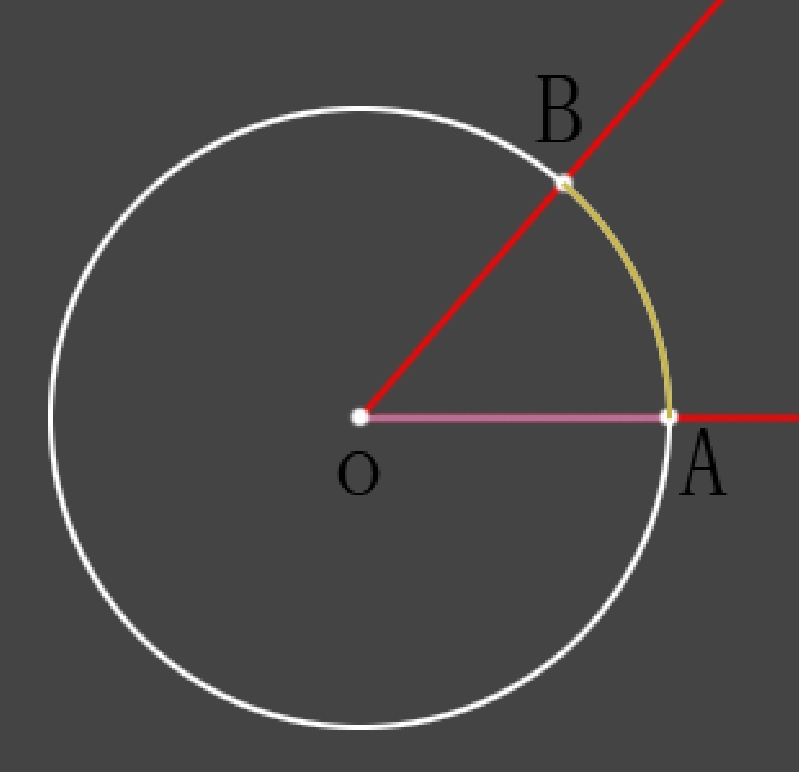

# 辐射度量学

#### 立体角

​	要了解立体角的概念，我们从一个熟悉的概念开始介绍，弧度。

​	在数学和物理中，弧度是角的度量单位。缩写是 rad。定义是：弧长等于半径的弧，其对应的圆心角为1弧度。

​	如图所示，当 弧AB = 半径 OA 时，角AOB的弧度值为1。弧度制其实就是用弧长来表示角的大小。

​	用长度来表示平面角的大小，将这种思维类比到三维空间，长度 类比为 面积，平面角 就类比为 立体角。